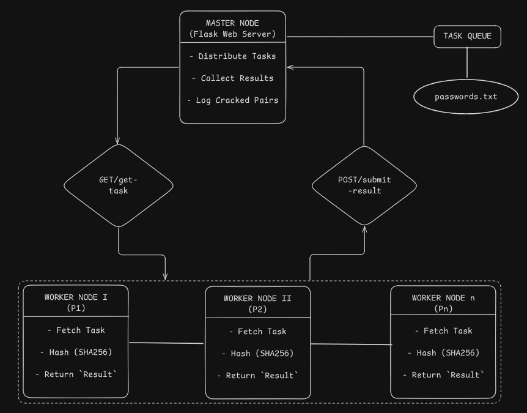

# 🔐 Password Cracking Simulator (PCS)

A lightweight and simplified simulator that demonstrates how password cracking can be accelerated using distributed systems principles. Built using Python and Flask, PCS uses a master-worker architecture to emulate real-world password cracking workflows—**ethically and safely** using only synthetic data.

> [!NOTE]
> This project is meant for educational purposes **ONLY** and should never be used for unethical purposes. The main focus is to showcase the working of Distibuted System concept among different fields.

## Addressing Current System Issues

### Limitations in Existing Systems

| Problem | Limitation in Current Tools | PCS Solution |
|--------|-----------------------------|--------------|
| Complexity | Tools like Fitcrack require advanced setups (BOINC, GPUs) | Simplified architecture using Python + Flask |
| Ethical Concerns | Real tools use actual password hashes or cracked data | Only synthetic data used in PCS |
| Lack of Transparency | Tools are black-boxed, difficult to understand for learners | Full visibility into queueing, distribution, and logic |
| No Teaching Focus | Designed for performance, not pedagogy | Designed for student-friendly understanding and experimentation |
| Hidden Fault Behavior | Failures handled internally with no explanation | PCS (extensible) can simulate node failures and retries |

## 🎯 Project Goals

- Demonstrate **task distribution** in distributed systems
- Showcase **worker coordination and resilience**
- Promote **security awareness** around password vulnerabilities
- Provide an **educational and ethical** tool to simulate password cracking

## 🏗️ Architecture



The system follows a master-worker distributed architecture:
- **Master Node**: Coordinates tasks, manages worker health, distributes workload
- **Worker Nodes**: Process password cracking tasks, report results and status
- **GUI Dashboard**: Real-time monitoring and control interface

## 🚀 Quick Start

### Prerequisites
- Python 3.7+
- pip package manager

### Installation

1. **Clone the repository**
   ```bash
   git clone https://github.com/Louis047/PCS.git
   cd PCS
   pip install -r requirements.txt
   ```
